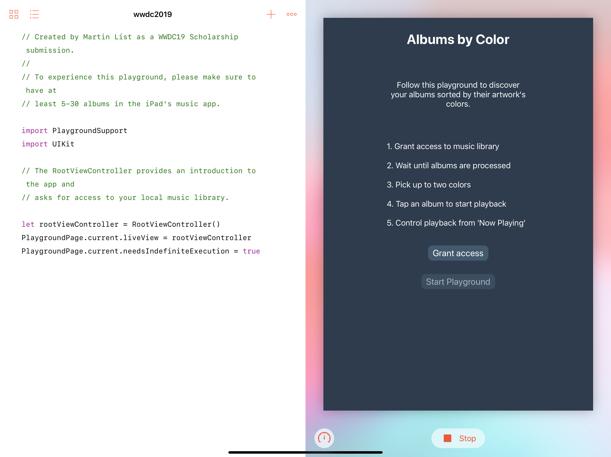
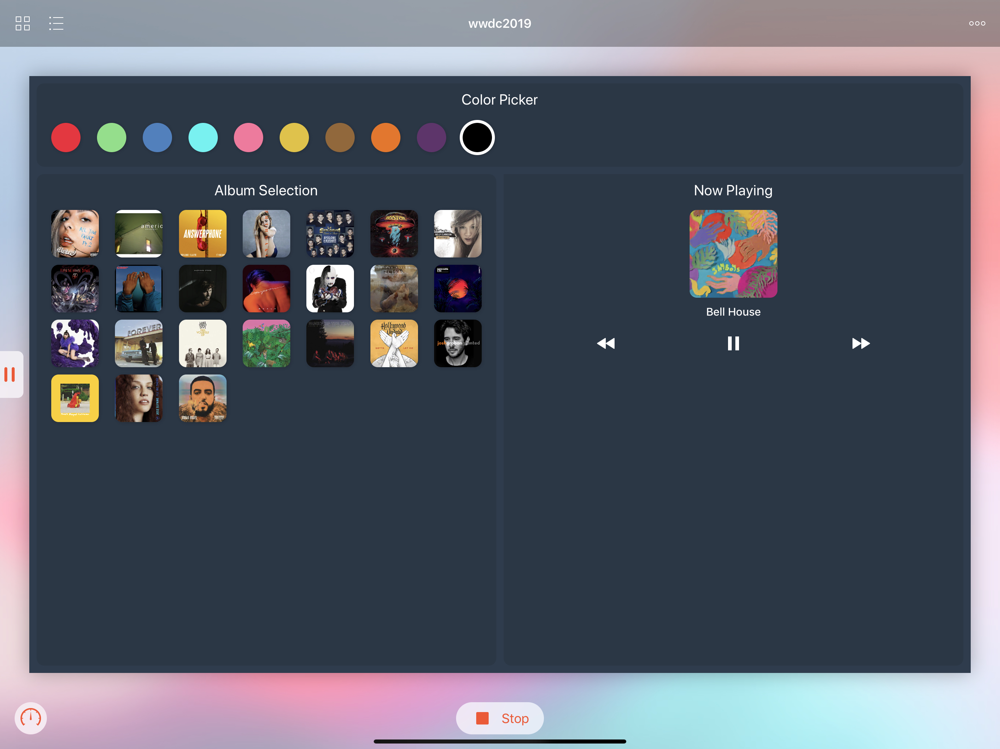

# Albums by Color
'Albums by Color' is an iPad Playground for the WWDC 2019 scholarship application, that enables users to sort their music albums by  color.

# Credits
The Playground uses [UIImageColors]( https://github.com/jathu/UIImageColors) by Jathu Satkunarajah (MIT) to identify an album's colors.